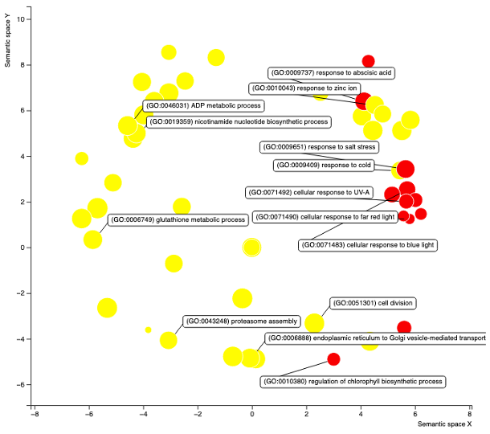

```{r setup, include=FALSE}

# libraries
suppressPackageStartupMessages({
  library(DOSE)
  library(dplyr)
  library(enrichplot)
  library(ggplot2)
  library(here)
  library(learnr)
  library(org.Hs.eg.db)
  library(readr)
  library(tibble)
  library(topGO)
  library(UpSetR)
})

# options
knitr::opts_chunk$set(echo = FALSE)
tutorial_options(
  exercise.reveal_solution=TRUE,
  exercise.lines=5)


# step to reproduce
# ---
# G03_vs_G02_at_T04_simple <- read_tsv(file=here("tutorials/04_gene_set_enrichment_analysis/www/analysis/G03_vs_G02_at_T04_simple-model_DE-results.tsv"),show_col_types=FALSE)
# population <- G03_vs_G02_at_T04_simple %>% filter(!is.na(padj)) %>% dplyr::select(geneID,padj,log2FoldChange)
# population.score <- population$padj
# names(population.score) <- sub("\\.\\d+","",population$geneID)
# getDEgenes <- function(allScore){
#   alpha=0.01
#   return(allScore <= alpha)
# }
# alpha=0.01
# lfc=0.5
# population.score[abs(population$log2FoldChange) <= lfc] <- 1
# GOdata <- new("topGOdata",
#               description = "G03 vs. G02 at T04 (simple model)",
#               ontology = "BP",
#               allGenes = population.score,
#               geneSel = getDEgenes,
#               nodeSize = 5,
#               annot = annFUN.org,
#               mapping="org.Hs.eg.db",
#               ID="ensembl")
# 
# test.stat <- new("parentChild",testStatistic = GOFisherTest, name = "Parent Child")
# resultPC <- getSigGroups(GOdata, test.stat)
# FDR <- p.adjust(score(resultPC),method="BH")
# 
# classicFisher <- runTest(GOdata,algorithm="classic",statistic="fisher")
# elimFisher <- runTest(GOdata,algorithm="elim",statistic="fisher")
# parentchildFisher <- runTest(GOdata,algorithm="parentchild",statistic="fisher")
# weight01Fisher <- runTest(GOdata,algorithm="weight01",statistic="fisher")
# 
# symbols <- select(org.Hs.eg.db,keys=names(population.score),columns="SYMBOL",keytype="ENSEMBL")
# symbols <- symbols[!duplicated(symbols$ENSEMBL),]
# 
# input <- population %>% mutate(
#   gene_ids=symbols$SYMBOL[match(sub("\\.\\d+","",geneID),symbols$ENSEMBL)],
#   is_candidate=ifelse(!is.na(padj) &
#                         padj <= 0.01 &
#                         abs(log2FoldChange) > 0.5,1,0)) %>%
#   filter(! is.na(gene_ids)) %>%
#   dplyr::select(gene_ids,is_candidate) %>% as.data.frame()
# 
# goFunc <- go_enrich(input, n_randsets=100,orgDb='org.Hs.eg.db',domains="biological_process")
# res <- goFunc$results[order(goFunc$results$FWER_overrep),]
# sel <- res$FWER_overrep <=0.01
#
# entrez <- select(org.Hs.eg.db,keys=names(population.score),
#                  columns="ENTREZID",keytype="ENSEMBL")
# 
# entrez <- entrez[!duplicated(entrez$ENSEMBL),]
# 
# stopifnot(all(names(population.score) == entrez$ENSEMBL))
# 
# de <- population.score
# 
# names(de) <- entrez$ENTREZID
# 
# geneList <- population$log2FoldChange
# names(geneList) <- names(de)
# 
# tab <- table(names(geneList)) 
# 
# duplicates <- geneList[names(geneList) %in% names(tab)[tab==2]]
# boxplot(split(duplicates,names(duplicates)),las=2)
# 
# geneList <- geneList[order(abs(geneList))]
# geneList <- geneList[!duplicated(names(geneList))]
# 
# edo <- enrichDGN(names(de)[de <= 0.01])
# 
# edo2 <- gseDO(sort(geneList,decreasing=TRUE))
#
# edox <- setReadable(edo, 'org.Hs.eg.db', 'ENTREZID')
#
# save(G03_vs_G02_at_T04_simple,
#      population,population.score,
#      GOdata,resultPC,FDR, getDEgenes,
#      G03_vs_G02_at_T04, alpha, lfc,
#      fpopulation,fpopulation.score,
#      fGOdata,classicFisher,
#      elimFisher,parentchildFisher,
#      weight01Fisher,comp, goFunc,
#      res, sel,
#      symbols,input,entrez,
#      de, geneList, edo, edo2, edox,
#      file=here("tutorials/04_gene_set_enrichment_analysis/www/data.rda"))
```

## Introduction

Now that we have run the Differential Expression Analysis, what do we do with our results?

Mostly, you will select a few candidates and do functional characterisation in the lab, right?

So you went ballistic and did a whole genome analysis only to look at a couple genes?

There must be another way to look at the data! Gene Set Enrichment Analysis (GSEA) is one possibility.

GSEA aims at answering the question: is my list of genes (the gene set) associated with the experimental condition? For example, "are there unusually many de-regulated genes in my gene list?" or "is my DE gene list enriched for some functional processes?".

Let us load the DE data we generated yesterday.

```{r load, exercise=TRUE, exercise.eval=FALSE}

```

```{r load-hint}
# you should not need hints anymore, do you?
?read_tsv
```

```{r load-solution}
DEres <- read_tsv(file=here("inst/tutorials/03_differential_gene_expression/some_results.tsv"),show_col_types=FALSE)
```


```{r DE_setup, eval=TRUE, include=FALSE}
DEres <- read_tsv(file=here("inst/tutorials/03_differential_gene_expression/some_results.tsv"),show_col_types=FALSE)

```


Now, that we have restored the DE results in `R` from our analysis, we can start to do a gene ontology enrichment analysis. There are many ways to do so, and many online tools too, but for now, we will use a `R` package called `topGO`. `topGO` is a package that was developed at the time when expression profiling was done on microarray and while the package is still relevant nowadays, the documentation has aged and is far from being comprehensive.

## Gene Set Enrichement Analysis

There are many Gene Set Enrichement Analysis (GSEA) methods, Bioconductor had as of November 2022, [146](http://bioconductor.org/packages/release/BiocViews.html#___GeneSetEnrichment) packages flagged as GSEA capable.

Still, most of these rely on three approaches, reviewed in [Khatri et al., 2012](https://journals.plos.org/ploscompbiol/article?id=10.1371/journal.pcbi.1002375). These are:

* Over-representation analysis (ORA): is a type of differentially expressed (DE) genes in the set more common than expected from the population? For example, is 1 gene in 10 of the upregulated genes a transcription factor, when transcription factors are 1 gene in 100 in the expressed genes?


* Functional class scoring (FCS): summarize statistic of DE of genes in a set, and compare to a null (typically permutation of the sample labels)
* Pathway topology (PT): include pathway knowledge in performing FCS, _e.g._ the number and type of interactions between gene products

{width=80%}

You are probably already familiar with a number of tools and websites that offer GSEA, for example, [KEGG](https://www.genome.jp/kegg/), [Reactome](https://reactome.org/), and most certainly you have have heard or read about [Gene Ontology](http://geneontology.org/) enrichment. Let's have a GO at the latter (sorry, bad pun...)

## Gene Ontology Enrichment

### Gene Ontology

Gene Ontology (GO) is a controlled vocabulary that assign to a gene one-to-many:

* Biological Process(es)
* Cellular Component(s)
* Molecular Function(s)

The vocabulary is hierarchical, organised as a [directed acyclic graph](https://en.wikipedia.org/wiki/Directed_acyclic_graph) (DAG)

{width=50%}

As one goes further away from the highest level terms Biological Process, Cellular Component and Molecular Function, terms get more and more specific.

### Enrichment

#### Over Representation Analysis

Gene Ontology Enrichment is commonly an Over Representation Analysis (ORA)) where we look for the over representation of Gene Ontology (GO) terms in a **set** of genes as compared to the rest of the **population**.

A classical approach is a statistical analysis based on the one-sided Fisher's exact test (hypergeometric distribution).

| |gene set|population|total|
| :---: | :---: | :---: | :---: |
|DE|k|K-k|K|
|notDE|n-k|N+k-n-K|N-K|
|total|n|N-n|N|

```{r population-quizz}
quiz(caption="A 'population'?",
     question("What is it?",
              answer("All the genes of the organism of interest"),
              answer("All the genes expressed in the study",
                     correct=TRUE),
              answer("All the genes not in the gene-set")
     ))
```
There are some caveats with the fisher test too. [Bauer S. _et al._, 2008](https://academic.oup.com/bioinformatics/article/24/14/1650/182451) expresses it this way:

_A disadvantage of this method_ (Fisher's one sided exact test) _is that it ... disregards dependencies related to annotations ... a gene which is annotated to t is also annotated to all parents ... This leads to a problem if we consider multiple terms simultaneously: the chance of t being enriched is much higher if one or more of its parental terms is enriched._

In other words, enrichment can propagate downwards through the DAG GO graph. To address this, [Grossmann _et al._,2007](https://academic.oup.com/bioinformatics/article/23/22/3024/208216) and Bauer _et al._, proposed and implemented the `Parent-Child` test.

{width=80%}

{width=80%}

Clearly the Parent-Child approach by considering the context of the enrichment might prevent the propagation of enrichment down the DAG tree.

---

#### Functional Class Scoring

There are other methods that have been developed to perform GO Enrichment, some of them using the Functional Class Scoring (FCS) GSEA approach, _e.g._ [Glass and Girvan, 2014](https://www.nature.com/articles/srep04191)

{width=80%}

---

#### Other limitations

Gene ontology annotation (and any other annotation for that matter) are commonly inferred electronically from model organism.

Does it matter? Yes. Take a look at the figure below showing the quality of the GO annotation of all plant species present in the PLAZA database. _Well characterized_ means that a gene is associated with 10 GO terms or more.

{width=80%}

Only the model organism _Arabidopsis thaliana_ is decently annotated. If we look into further details at the type of annotation, the vast majority of plants, but the most studied ones, have only annotation of the type "Inferred from Electronic Annotation" (IEA).

{width=80%}

```{r limitation-quizz}
quiz(caption="Limitations",
     question("Which of the following are limitations of a GSEA?",
              answer("The annotations are partial",correct=TRUE),
              answer("The database are only informed by what scientists study",correct=TRUE),
              answer("Non model organisms suffer from a lack of annotation",correct=TRUE),
              answer("Non model organisms suffer from a lack of manually verified annotation",correct=TRUE),
              try_again=TRUE,
              post_message="And the list goes on and on..."
     ))
```

### TopGO
#### Population

As we have seen, there are a number of aspects we will need to manage, including the choice of test (Parent-Child if available) and the definition of the population.

We start with the latter. Use the following code block to extract the population we will compare our set to. Just a few reminders, the population cannot be the whole gene catalog, as not all genes are expressed. Then, should genes that are expressed below the signal to noise cutoff even be considered? After-all they are uninformative. One way to identify the genes rejected by DESeq() during its independent filtering step is to look for genes which have a `NA` value as their FDR (padj). Use the following block to define your population.


```{r population, exercise=TRUE, exercise.eval=FALSE, exercise.setup="DE_setup"}

```

```{r population-hint-1}
?filter
?is.na
```

```{r population-hint-2}
population <- DEres %>% filter(!is.na(padj))
```

```{r population-solution}
# a more advanced solution, keeping only the columns of interest
population <- DEres %>% filter(!is.na(padj)) %>% dplyr::select(geneID,padj,log2FoldChange)
```


```{r population_setup, eval=TRUE, include=FALSE}
DEres <- read_tsv(file=here("inst/tutorials/03_differential_gene_expression/some_results.tsv"),show_col_types=FALSE)
population <- DEres %>% filter(!is.na(padj)) %>% dplyr::select(geneID,padj,log2FoldChange)

```

Next, we will set up the objects needed for `topGO`. That information was devised from the `topGO` package vignette.


<!-- Edoardo: 
I rewrote some of the following commands to use tidyverse, as they will learn that during the first day.
I also implemented both padj and FC filter outside of the TopGO analysis, rather than writing a function to do that.
-->

#### Filtering the data
Before we run the analysis, we must extract from the population the set of genes we will test for over-representation of GO terms.
If the population contain information about all the expressed genes, the sets of genes we analyse are the genes that we think might be contributing to our observed phenotype, and they are therefore the group of genes that we want to know the function of.
In our case, the sets we must extract are the upregulated genes and the downregulated ones.

To get them, we must filter according to padj, as discussed yesterday, but also according to log2FC, so we only get genes significantly more or less expressed in the condition of interest, compared to the control condition.

Write some code to get the list of Upregulated and Downregulated genes, using a padj threshold of 0.01 and a log2FC threshold of 0.5.

```{r genesets, exercise=TRUE, exercise.eval=FALSE, exercise.setup="population_setup"}

```

```{r genesets-hint-1}
?filter
?is.na
```

```{r genesets-hint-2}
Upregulated <- population %>% filter(padj < 0.01) %>% filter(log2FoldChange)
Downregulated <- population %>% filter(padj < 0.01) %>% filter(log2FoldChange)
```

```{r genesets-solution}
Upregulated <- population %>% filter(padj < 0.01) %>% filter(log2FoldChange > 0.5)
Downregulated <- population %>% filter(padj < 0.01) %>% filter(log2FoldChange < 0.5)
```


#### Loading GO data
In order to know if a GO term is over-represented in our gene sets of interest, compared to the whole population, we must know which genes are annotated with each GO term.
Use the following code to load the gene annotation of the species your group is using. Then, filter the dataset so it includes only the genes present in the population, then save the resulting object in a rds format.

```{r annotation, exercise=TRUE, exercise.eval=FALSE, exercise.setup="population_setup"}

# Spruce GO 
spruce_genes <- read.csv(here("inst/tutorials/04_gene_set_enrichment_analysis/files/spruce_go_new_ids.csv"), header = TRUE)
geneID2GO <- unstack(spruce_genes[,c(1,2)])

# Pine GO 
pine_genes <- read.csv(here("inst/tutorials/04_gene_set_enrichment_analysis/files/Pinsy01_go_ids_mod.csv"), header = TRUE)
geneID2GO <- unstack(pine_genes[,c(1,2)])

# Aspen GO
geneID2GO <- readMappings(here("inst/tutorials/04_gene_set_enrichment_analysis/files/Potra02_go_ids.tsv"))[-1]


```


```{r annotation-hint-1}
?filter
?select
?pull
```

<!-- Edoardo: I do not actually know if the pull command is necessary here -->

```{r annotation-solution}
# Spruce GO 
spruce_genes <- read.csv(here("inst/tutorials/04_gene_set_enrichment_analysis/files/spruce_go_new_ids.csv"), header = TRUE)
geneID2GO <- unstack(spruce_genes[,c(1,2)])

# Pine GO 
pine_genes <- read.csv(here("inst/tutorials/04_gene_set_enrichment_analysis/files/Pinsy01_go_ids_mod.csv"), header = TRUE)
geneID2GO <- unstack(pine_genes[,c(1,2)])

# Aspen GO
geneID2GO <- readMappings(here("inst/tutorials/04_gene_set_enrichment_analysis/files/Potra02_go_ids.tsv"))[-1]

ExpressedGenes <- population %>% dplyr::select(geneID) %>% pull()
geneID2GO <- geneID2GO[names(geneID2GO) %in% ExpressedGenes]
saveRDS(geneID2GO,file=here("inst/tutorials/04_gene_set_enrichment_analysis/geneID2GO.rds"))

```

```{r geneID2GO_setup, eval=TRUE, include=FALSE}
DEres <- read_tsv(file=here("inst/tutorials/03_differential_gene_expression/some_results.tsv"),show_col_types=FALSE)
population <- DEres %>% filter(!is.na(padj)) %>% dplyr::select(geneID,padj,log2FoldChange)
Upregulated <- population %>% filter(padj < 0.01) %>% filter(log2FoldChange > 0.5)
Downregulated <- population %>% filter(padj < 0.01) %>% filter(log2FoldChange < 0.5)
geneID2GO <- readRDS(here("inst/tutorials/04_gene_set_enrichment_analysis/geneID2GO.rds"))

```

#### Setting the GOdata object
In order to run TopGO, we first must define a GOdata object containing the information we collected so far. Namely, it must contain the list of genes included in the population, their GO terms, which type of GO terms we will test for (BP: biological processes, CC: cellular components, MF: molecular functions) and which genes are in our gene set of interest.
We will test for BPs, which are the GO terms most commonly used, but you can easily investigate the other GO terms using "MF" and "CC".
Similarly, in the presented code we will run the test for the Upregulated genes, but you should run it also for the downregulated ones.

```{r GOdata, exercise=FALSE, exercise.setup="geneID2GO_setup", exercise.eval=TRUE}
geneList <- factor(as.integer(names(geneID2GO) %in% Upregulated$geneID))
names(geneList) <- names(geneID2GO)

GOdata <- new("topGOdata", 
              ontology = "BP", 
              allGenes = geneList,
              annot = annFUN.gene2GO, 
              gene2GO = geneID2GO)

allGO <- usedGO(GOdata)


```


#### Testing

Now that the object is set up (it has retrieved the annotation and linked our gene set), we can define the testing. `topGO` supports the `Parent Child` test, but again, it took a while to find that information.

```{r test, exercise=TRUE, exercise.eval=FALSE, exercise.timelimit=300, exercise.setup="GOdata"}
resultPC <- runTest(GOdata, 
                    algorithm = "parentchild",
                    statistic = "fisher")
```

#### Multiple testing correction.

Observe the `topGO` package does not do any multiple testing correction by default (it was very debated back then and the arguments of the authors are still valid). As this is nonetheless IMO recommendable, we run a Benjamini-Hochberg correction.
The function "GenTable" of the TopGO package allows us to export the enriched GOs in a clear dataframe, where we can adjust the pvalue and add the results as an additional column.
The topnodes argument indicate the number of GOs to be included in the table, in this case we get all of them, but then filter out those that have adjusted pvalues higher than 0.01.


```{r mtest, exercise=TRUE, exercise.eval=FALSE,exercise.setup="test" }
FDR <- p.adjust(score(resultPC),method="BH")
allResSig <- GenTable(GOdata, 
                   parentchildFisher = resultPC, 
                   orderBy = "parentchildFisher",
                   topNodes = length(allGO)) %>% 
  mutate_at(c('parentchildFisher'), as.numeric) %>%
  mutate(padj = round(p.adjust(parentchildFisher, method = "BH"), digits = 4)) %>%
  arrange(padj) %>% filter(padj < 0.05)
```

#### Results

That's it! We have performed our enrichment! Let's look at the results:


```{r results, exercise=TRUE, exercise.eval=FALSE, exercise.setup="mtest"}
dim(allResSig)
allResSig
```

### Visualisation
It is always interesting to visualise results both for assessing and explaining them


#### Visualizing the more significant GO terms
A quick analysis to do is to assign to each enriched GO term a score equal to the -log10() of its adjusted pvalue, so the closest the padj is to zero the higher the score will be, and then to visualize which terms have the highest score. They will be the ones with the highest over representation in the gene set of interest, compared to the whole population.
Can you add to the dataset a column containing these scores?


```{r resScore, exercise=TRUE, exercise.eval=FALSE, exercise.setup="mtest"}
allResSig

```


```{r resScore-hint-1}
?mutate
```


```{r resScore-solution}
allResSig <- allResSig %>% mutate(scores = -log10(padj))
```


Then, we can visualize the terms according to their score using a wordcloud, a type of graph where the GO terms with the higher scores will appear bigger:

```{r wordcloud, exercise=TRUE, exercise.eval=FALSE, exercise.setup="mtest"}
allResSig <- allResSig %>% mutate(scores = -log10(padj))
library(wordcloud)
wordcloud(words = allResSig$Term, 
          freq = allResSig$score, 
          min.freq = 0,           
          max.words = 200, 
          random.order = FALSE, 
          rot.per = 0, 
          scale = c(2, 1),  
          colors = brewer.pal(8, "Dark2"))
  
```

---

#### Exploration

```{r exploration, exercise=TRUE, exercise.eval=FALSE, exercise.setup="mtest"}

suppressPackageStartupMessages(showSigOfNodes(GOdata, score(resultPC), firstSigNodes = 5, useInfo = 'def'))

suppressPackageStartupMessages(showSigOfNodes(GOdata, FDR, firstSigNodes = 5, useInfo = 'def'))

```

---

There are many other alternatives to visualise data, so let us export our results

```{r export, exercise=TRUE, exercise.eval=FALSE, exercise.setup="mtest"}
alpha=0.05
enr <- tibble(ID=names(FDR)[FDR <= alpha],
       FDR=FDR[FDR<=alpha])


write_tsv(enr,file=here("inst/tutorials/04_gene_set_enrichment_analysis/results_GO-enrichment.tsv"))
```


Now that we have exported the data, we can use them in other resources, one that I like is [REVIGO](http://revigo.irb.hr). Copypaste there the names of the enriched GOs and their adjusted pvalue, in two columns, and look at the results.

Revigo returns a plot in which GO terms are represented by circles:

- Circles next to each other represent GO terms with similar meanings.
- Bigger circles represent more general GO terms.
- Redder circles represent more significant GO terms.


````{r Revigo, eval=TRUE, echo=FALSE}

````

#### Comparing algorhitms

So how did I know about these methods? Mostly by searching on Bioconductor and reading the package [vignette](https://bioconductor.org/packages/release/bioc/html/topGO.html). TopGO has two functions that can be used to retrieve a list of existing enrichment algorithms and tests.

```{r algo, exercise=TRUE, exercise.eval=FALSE}
whichAlgorithms()
whichTests()
```

### Many algorithms
Now that we know about the possibilities, and after taking a look at the vignette's **Table 1**, we can select a number of algorithms to run and the `fisher` test (as it is the only test supported by all algorithms). **For the sake of the time, run just one, or be ready to wait five minutes...**

```{r tests, exercise=TRUE, exercise.eval=FALSE, exercise.timelimit=300, exercise.setup="mtest"}
classicFisher <- runTest(GOdata,algorithm="classic",statistic="fisher")
elimFisher <- runTest(GOdata,algorithm="elim",statistic="fisher")
parentchildFisher <- runTest(GOdata,algorithm="parentchild",statistic="fisher")
weight01Fisher <- runTest(GOdata,algorithm="weight01",statistic="fisher")
```

We will again use`GenTable`. That function is actually very versatile and could be used to compare different sets of results, _e.g._:
Remember to remove the results of the tests that you did not perform.

```{r comparison, exercise=TRUE, exercise.eval=FALSE, exercise.lines=10, exercise.timelimit=300, exercise.setup="tests"}

comp <- as_tibble(GenTable(GOdata,classicFisher=classicFisher,
         elimFisher=elimFisher,
         parentchildFisher=parentchildFisher,
         weight01Fisher=weight01Fisher,
         orderBy="parentchildFisher",
         topNodes=sum(p.adjust(score(parentchildFisher),method="BH") <= 0.05)))
```

Now that we built a comparison of three methods against the `parentchild` reference, let us visualise the results of the overlap. This is usually done using Venn diagrams, but these quickly turn cumbersome to interpret and are hard to draw for more than five sets. Instead, a more generic visualisation are the `upset` plots from the library [UpSetR](https://cran.r-project.org/web/packages/UpSetR/index.html). The `upset` function expects a list of numerical vectors, where an overlap is represented by the same value being present across multiple lists - see the [Basic Usage](https://cran.r-project.org/web/packages/UpSetR/vignettes/basic.usage.html) vignette. We will use `dplyr` to extract the data from the results of `GenTable` and turn it into a boolean matrix.

```{r upset, exercise=TRUE, exercise.eval=FALSE, exercise.lines=12, exercise.setup="comparison", exercise.timelimit=300}
library(UpSetR)
dat <- comp %>% dplyr::select(contains("Fisher") & -starts_with("Rank")) %>% 
  mutate_if(is.character,parse_double) %>% 
  mutate_all("<",0.01)

# a quick estimation
dat %>% summarise(across(everything(),sum))

# creating the list and plotting
upset(fromList(apply(dat,2,which)))

```

Which tests were similar between each other? Which ones were more conservative?

The vignette from the `topGO` package has a section arguing (mostly) against multiple testing correction. Redo the previous analysis, without the multiple testing correction.

```{r comp2, exercise=TRUE, exercise.eval=FALSE, exercise.lines=15, exercise.setup="tests", exercise.timelimit=300}

```

```{r comp2-solution}
comp <- as_tibble(GenTable(GOdata,classicFisher=classicFisher,
         elimFisher=elimFisher,
         parentchildFisher=parentchildFisher,
         weight01Fisher=weight01Fisher,
         orderBy="parentchildFisher",
         topNodes=sum(score(parentchildFisher) <= 0.01)))

dat <- comp %>% dplyr::select(contains("Fisher") & -starts_with("Rank")) %>% 
  mutate_if(is.character,parse_double) %>% mutate_all("<",0.01)
dat %>% summarise(across(everything(),sum))

upset(fromList(apply(dat,2,which)))

```

Did the results change? Are the most conservative tests the same?

### A few words about other tools

There are numerous possibilities for running a GO enrichment analysis in R. A quick search reveals numerous packages, _e.g._ [GOfuncR](https://bioconductor.org/packages/release/bioc/vignettes/GOfuncR/inst/doc/GOfuncR.html), [simplifyEnrichment](https://bioconductor.org/packages/simplifyEnrichment/), [ViSEAGO](https://bioconductor.org/packages/ViSEAGO), [clusterProfiler](https://bioconductor.org/packages/release/bioc/html/clusterProfiler.html), _etc._

We will not explore them, but it is good that you know that TopGO is not the only solution.

No matter which one you use, all these tools will depend on having an annotation of the genes in your organism, so let's talk briefly about annotations.

---

#### Annotations

Most (model) organisms will have annotation available at [Bioconductor](http://bioconductor.org/packages/release/BiocViews.html#___Organism). It is a huge ecosystem of packages and there are many ways to create the annotation one needs for use in `R`. This is outside the topic of this tutorial, but just for reference, one entry point would be the [AnnotationForge](http://bioconductor.org/packages/release/bioc/html/AnnotationForge.html)
 package.
 
 For access to more annotation, not only those listed at Bioconductor, the [AnnotationHub](http://bioconductor.org/packages/release/bioc/html/AnnotationHub.html) package. Both these packages and most of the ecosystem relies on the [AnnotationDBi](http://bioconductor.org/packages/release/bioc/html/AnnotationDbi.html) package: _Annotation DB interface_. That package has few functions to manipulate annotations: `colums`, `keys`, `keytypes`,  and `select`. 
 


## Session Info
It is good practice and highly recommended to always include the session info in your analyses. This way other can reproduce them with the exact same versions of the packages you used. Use the help to find out how to print the session info.

```{r session-info, exercise=TRUE, exercise.eval=TRUE}

```

```{r session-info-solution}
sessionInfo()
```

## Copyright
This material is provided under the following license:

`CC-BY-NC-SA 4.0:` _Creative Commons Attribution-NonCommercial-ShareAlike 4.0 International Public License_

by **BN Bioinformatics Handelsbolag**

